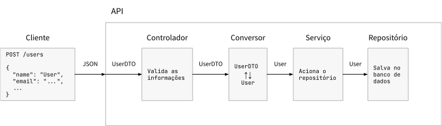
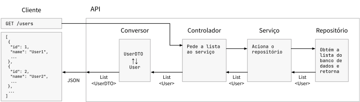
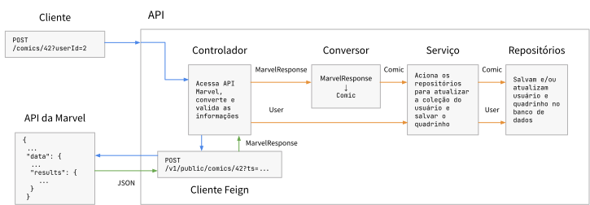
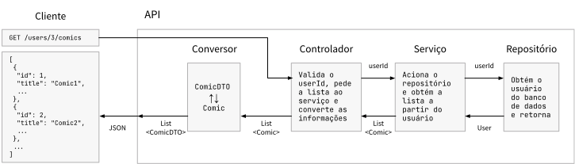

# Spring — Desenvolvendo uma API para gerenciamento de coleções de quadrinhos

Thiago Cavalcante, 02/02/2022

O código completo deste projeto pode ser acessado no [GitHub][].

## Sumário

- [Sumário](#sumário)
- [Descrição do sistema](#descrição-do-sistema)
- [Inicialização do projeto](#inicialização-do-projeto)
- [Escolha das dependências](#escolha-das-dependências)
- [O Padrão MVC e a organização do projeto](#o-padrão-mvc-e-a-organização-do-projeto)
- [Utilização de testes automatizados](#utilização-de-testes-automatizados)
- [Início da implementação: Usuários](#início-da-implementação-usuários)
  - [Criação da entidade Usuário](#criação-da-entidade-usuário)
  - [Definição das ações e URLs da API](#definição-das-ações-e-urls-da-api)
  - [Cadastro dos usuários no sistema](#cadastro-dos-usuários-no-sistema)
  - [Busca de usuários cadastrados](#busca-de-usuários-cadastrados)
- [Adição dos quadrinhos à API](#adição-dos-quadrinhos-à-api)
  - [Criação da entidade Quadrinho](#criação-da-entidade-quadrinho)
  - [A relação entre os quadrinhos e a API da Marvel](#a-relação-entre-os-quadrinhos-e-a-api-da-marvel)
  - [Spring Cloud OpenFeign: consumindo a API da Marvel](#spring-cloud-openfeign-consumindo-a-api-da-marvel)
  - [Cadastro dos quadrinhos no sistema](#cadastro-dos-quadrinhos-no-sistema)
  - [Busca de coleções de quadrinhos](#busca-de-coleções-de-quadrinhos)
- [Referências](#referências)

---

## Descrição do sistema

Nosso objetivo é desenvolver uma API REST[^1] onde podem ser cadastrados usuários e quadrinhos. Nesse sistema, cada usuário pode estar associado a múltiplos quadrinhos (sua coleção). As informações desses quadrinhos são obtidas com a [API da Marvel][Marvel Developer Portal], que fornece todos os detalhes de um quadrinho a partir do seu identificador único — `comicId`. Além do cadastro de usuários e quadrinhos, o sistema que vamos desenvolver também possui duas funções de busca de informações:

- Lista de usuários cadastrados, sem exibir as coleções de quadrinhos
- Coleção de quadrinhos de um usuário específico, obtida a partir do seu id

Com relação à última função de busca, há ainda uma outra caraterística do sistema: são atribuídos preços aos quadrinhos e eles recebem um desconto de acordo com o dia da semana e o seu código ISBN. Quando a busca é realizada, os quadrinhos para os quais esse desconto é aplicável são retornados com os preços atualizados.

## Inicialização do projeto

Podemos utilizar a ferramenta [Spring Initializr][] para criar um "esqueleto" do projeto que será o ponto de partida para a implementação da API. A criação desse projeto base requer algumas configurações:

- **Ferramenta para gerenciamento de dependências:** vamos utilizar **Gradle**, por ser uma ferramenta mais moderna, mais rápida, e com uma sintaxe de configurações mais simples e concisa;
- **Linguagem de programação:** a API será implementada em **Java**;
- **Versão do Spring Boot:** usaremos a versão estável mais recente do Spring Boot, **2.6.3**;
- **Empacotamento:** essa opção está ligada à maneira como será feito o *deployment* do projeto, algo que está fora do escopo desse texto. Por isso, vamos deixar a opção **Jar**;
- **Versão Java:** 11;
- **Metadados**: ficam a critério do desenvolvedor.

## Escolha das dependências

Para que a API REST possa ser implementada, é necessário incluir **dependências** no nosso projeto base. As dependências consistem em grupos de pacotes que adicionam uma ou mais funcionalidades em um projeto. O sistema que estamos desenvolvendo precisará das seguintes funcionalidades:

- Capacidade de criação de uma API REST, fundamental para o nosso projeto;
- Integração com banco de dados, para armazenar e relacionar usuários e quadrinhos;
- Integração com a API da Marvel, para obtenção de informações dos quadrinhos;
- Validação das informações de cadastro, para evitar problemas como campos vazios ou dados inválidos.

A tabela a seguir relaciona cada funcionalidade com as dependências correspondentes:

| FUNCIONALIDADE                | DEPENDÊNCIA                          |
| ----------------------------- | ------------------------------------ |
| Criação de API REST           | **Spring Web**                       |
| Integração com banco de dados | **Spring Data JPA**, **H2 Database** |
| Integração com API da Marvel  | **OpenFeign**                        |
| Validação de informações      | **Validation**                       |

Além das dependências listadas, todos os projetos gerados com o Spring Initializr possuem também a dependência para criação de testes automatizados, que também vamos usar ao longo do projeto.

Antes de iniciar a implementação, é importante destacar a escolha do banco de dados para a API que estamos construindo. O [H2][H2 Database] é um banco de dados SQL *open-source* escrito em Java que é embutido no projeto e não necessita de nenhuma instalação adicional. Por ser leve e rápido, esse banco de dados geralmente é utilizado durante a fase de desenvolvimento, para fins de teste e prototipação. Outra funcionalidade interessante do H2 é o console que pode ser acessado pelo navegador para exploração do banco de dados.

Por padrão, os dados armazenados em um banco H2 são perdidos sempre que a aplicação é reiniciada. Esse comportamento pode ser modificado para que os dados sejam armazenados em um arquivo no sistema. No entanto, em um ambiente de produção onde a aplicação é utilizada pelos seus clientes, recomenda-se usar um banco de dados mais robusto, com funcionalidades extras que podem ser mais adequadas para a estrutura, tipo e quantidade de informações que se deseja armazenar.

## O Padrão MVC e a organização do projeto

Os projetos de aplicações web e APIs no Spring Framework seguem o **Padrão MVC** (*Model-View-Controller*). Nesse padrão, as requisições feitas à aplicação são direcionadas para os **controladores** adequados. Os controladores podem então acessar o **modelo** da aplicação (contém os dados e a lógica do sistema) para obter e processar informações para essa requisição, caso necessário. Por fim, a aplicação pode retornar uma **visualização** para o cliente, o resultado daquela requisição. No caso de uma API, essa visualização é apresentada no formato JSON (*JavaScript Object Notation*), muito usado na troca de informações entre sistemas.

É comum separar os diferentes componentes de um projeto que segue o padrão MVC em diferentes pastas, para manter o projeto organizado. Para essa API, vamos utilizar as seguintes pastas:

- `models`: classes de entidades (usuários e quadrinhos);
- `controllers`: classes de controladores;
- `repositories`: classes de repositórios, responsáveis pela obtenção de informações do banco de dados;
- `services`: classes de serviços, que contém as regras de negócio e atuam como elementos intermediários entre os controladores e os repositórios;
- outras pastas podem ser criadas de acordo com as necessidades do projeto.

## Utilização de testes automatizados

A implementação dessa API busca seguir um modelo de desenvolvimento baseado em TDD (*Test-Driven Development*). Nesse tipo de processo, os testes automatizados são escritos primeiro, de acordo com o comportamento esperado para o componente que está sendo testado, e então o código é implementado e modificado até que os testes sejam executados com sucesso. Os testes se dividem em:

- **Testes unitários**: são usados para testar a funcionalidade pontual de um determinado componente, utilizando *mocks* (objetos "de mentira" com comportamento pré-definido) para substituir objetos dos quais o componente depende para funcionar. São testes mais rápidos, criados em maior quantidade para testar casos de sucesso e falha nas diversas operações realizadas pelo componente;
- **Testes de integração**: são usados para testar a integração entre diversos componentes no sistema, utilizando objetos reais com o comportamento que foi implementado no código. São testes mais lentos, pois precisam de todo o contexto da aplicação para rodar (como se ela estivesse de fato sendo acessada por um cliente), podendo inclusive realizar alterações no banco de dados. Esses testes são, portanto, criados em menor quantidade.

Os testes são feitos utilizando os utilizando os *frameworks* de teste JUnit e Mockito. O Mockito permite a criação dos *mocks* citados previamente, além de outras funcionalidades. Os testes em controladores, assim como os testes de integração, necessitam do contexto da aplicação para que seja possível testar as requisições HTTP enviadas pelo cliente.

## Início da implementação: Usuários

### Criação da entidade Usuário

Vamos começar a implementação com a parte mais fundamental do nosso projeto: o cadastro e busca de usuários. O primeiro passo é criar uma classe para os usuários, contendo os campos de acordo com as especificações dadas na tabela a abaixo, onde um campo *único* significa que o valor daquele campo não pode se repetir em mais de um usuário (p. ex., não é permitido cadastrar dois usuários com o mesmo CPF).

| CAMPO                     | TIPO         | RESTRIÇÕES                                |
| ------------------------- | ------------ | ----------------------------------------- |
| Id                        | Long         | Único e gerado automaticamente            |
| Nome                      | String       | Obrigatório                               |
| Email                     | String       | Obrigatório, em um formato válido e único |
| CPF                       | String       | Obrigatório, válido e único               |
| Data de nascimento        | String       | Obrigatória e no formato DD/MM/AAAA       |
| Quadrinhos da coleção[^2] | Set\<Comic\> |                                           |

Para realizar o transporte de informações dentro da API vamos usar o padrão DTO (*Data Transfer Object*). Nesse padrão, são criadas uma ou mais classes de DTO além das classes de entidades. Os DTOs são POJOs (*Plain Old Java Objects*) que possuem apenas os atributos necessários para recebimento ou envio de informações para o cliente. Dessa forma, a validação dos dados deve ocorrer nos DTOs que são usados para receber informações. A implementação do padrão DTO também requer a criação de classes de **conversores** para que um DTO possa ser transformado em um objeto de entidade e vice-versa.

Nessa API que estamos desenvolvendo, existem duas classes de DTOs: uma para usuários e outra para quadrinhos. A classe de DTO de usuário é usada tanto para recebimento (cadastro) quanto para envio (busca) de informações e ela não possui o campo de quadrinhos da coleção. A classe de DTO de quadrinho é usada apenas no envio de informações, pois o cadastro é feito com as informações da API da Marvel.

Para transformar a classe de usuário em uma entidade do projeto, garantir a geração automática do `id`, e aplicar as validações dos dados no DTO, precisamos utilizar **anotações**. As anotações são comandos iniciados com `@` que podem ser usados em vários elementos do código para adicionar funcionalidades sem escrever código adicional.

As dependências do Spring introduzem diferentes anotações com propósitos variados. Por exemplo, um atributo de texto anotado com `@NotBlank` é considerado inválido se ele for nulo ou se seu tamanho for zero, ignorando espaços em branco no início e no final. O bloco abaixo mostra a classe de usuário DTO e a entidade de usuário:

```java
                                |   @Entity
public class UserDTO {          |   public class User {
                                |       @Id
                                |       @GeneratedValue
    private Long id;            |       private Long id;
                                |
    @NotBlank                   |
    private String name;        |       private String name;
                                |
    @NotBlank                   |
    @Email                      |
    @UniqueEmail                |
    private String email;       |       private String email;
                                |
    @NotBlank                   |
    @CPF                        |
    @UniqueCPF                  |
    private String cpf;         |       private String cpf;
                                |
    @NotBlank                   |
    @BrazilDateFormat           |
    private String birthDate;   |       private String birthDate;
}                               |   }
```

Podemos observar algumas anotações convenientes para o projeto, como `@Email` e `@CPF` para validação desses dados, e a anotação `@GeneratedValue`, que garante a geração automática dos ids de usuários. As anotações `@BrazilDateFormat`, `@UniqueEmail` e `@UniqueCPF` são validadores customizados, criados exclusivamente para atender aos requisitos do projeto.

### Definição das ações e URLs da API

Com a entidade de usuário devidamente criada, podemos começar a implementar as ações do sistema relativas aos usuários. Tais ações devem ser declaradas no controlador de usuário, responsável por receber as requisições do cliente. Para que essas ações sejam executadas, é necessário que existam URLs mapeadas até elas, associadas a comandos HTTP.

Em geral, uma API REST segue uma convenção de URLs e comandos HTTP que implementam as funções **CRUD** (*Create, Read, Update, Delete*) para manipulação de um determinado recurso do sistema. A tabela a seguir mostra como essa convenção se aplica a usuários em uma API REST:

| COM. HTTP | URL      | AÇÃO    | PROPÓSITO                                   |
| --------- | -------- | ------- | ------------------------------------------- |
| GET       | /users   | index   | Lista com todos os usuários                 |
| GET       | /users/1 | show    | Informações do usuário (id: 1)              |
| POST      | /users   | create  | Criar um usuário                            |
| PATCH     | /users/1 | update  | Atualizar as informações do usuário (id: 1) |
| DELETE    | /users/1 | destroy | Remover o usuário (id: 1)                   |

Tomando a tabela acima como base, podemos criar uma tabela das ações que serão implementadas nesse projeto:

| COM. HTTP | URL              | AÇÃO       | PROPÓSITO                                    |
| --------- | ---------------- | ---------- | -------------------------------------------- |
| GET       | /users           | index      | Lista com todos os usuários, sem as coleções |
| POST      | /users           | create     | Criar um usuário                             |
| GET       | /users/id/comics | userComics | Lista com quadrinhos do usuário (id: id)     |
| POST      | /comics/comicId  | create     | Criar um quadrinho a partir do comicId       |

No código do controlador, o mapeamento da URL e a associação com o comando HTTP são feitos com o uso de anotações. O nome da ação é usado na declaração do método que vai receber aquela requisição. O bloco a seguir mostra um cabeçalho simplificado para a ação `create`:

```java
@PostMapping(value = "/users") // Esta anotacao mapeia a URL e o comando HTTP
public void create(...) {      // (POST) de uma vez so.
    ...
}
```

### Cadastro dos usuários no sistema

Para cadastrar os usuários no sistema, o controlador deve receber do cliente uma requisição contendo os dados que a serem cadastrados (nome, email etc.). Esses dados serão armazenados em um objeto DTO, que será validado pelo sistema de acordo com as restrições citadas anteriormente. Com todas as informações validadas, o DTO será convertido para um objeto de entidade e enviado ao serviço de usuário para ser salvo no banco de dados. Para salvar o objeto no banco de dados, o serviço utiliza o repositório de usuário. A imagem a seguir ilustra esse processo:

{width=100%}

Caso as informações estejam válidas e o processo ocorra sem problemas, a API retorna o status com código HTTP 201 para o cliente, o que significa que a criação do recurso (usuário) ocorreu com sucesso. Caso exista algum problema com as informações recebidas, a API retorna o status com código HTTP 400, o que significa que houve uma solicitação inválida. Nesses casos onde existe um erro, o cliente recebe uma mensagem informando o erro ocorrido. É importante destacar que existem duas classes de erros HTTP, a depender do código numérico:

- **Erros de cliente (4xx)**: quando o cliente faz uma requisição inválida, que possui dados inválidos ou que não pode ser atendida pela aplicação;
- **Erros de servidor (5xx)**: quando a requisição está correta, mas o servidor não consegue atendê-la por diversos motivos (p. ex., falhas de implementação).

Para que o cliente receba uma mensagem de erro customizada lhe informando o que aconteceu, é necessário implementar um ou mais *exception handlers* na API. Este componente é chamado sempre que ocorre um erro na API e tem como responsabilidade criar uma resposta adequada para o cliente.

A implementação do *handler* dessa API pode tratar diferentes tipos de erros e possui um método de tratamento padrão, caso o erro ocorrido não se encaixe em nenhum dos outros tipos. Dessa forma, garante-se que o cliente vai receber uma mensagem de erro amigável, mesmo quando o erro não possuir um tratamento específico definido. O bloco a seguir compara as mensagens de erro retornadas pela API antes e depois da implementação do *handler*:

```json
// SEM HANDLER
"timestamp": "2022-01-28T21:14:54.299+00:00",
"status": 400,
"error": "Bad Request",
"path": "/users"

// COM HANDLER
"httpValue": 400,
"httpError": "Bad Request",
"message": "Validation failed with 2 errors.",
"errors": {                            // Agora o cliente sabe por que
    "name": "Name cannot be blank.",   // sua requisicao falhou. Ele tentou
    "email": "Email cannot be blank."  // cadastrar um usuario sem nome e
}                                      // sem email.
```

As mensagens foram obtidas com o software **Postman**. No [repositório][GitHub], é possível encontrar um arquivo do Postman com as requisições usadas durante o desenvolvimento da API.

### Busca de usuários cadastrados

Na busca de usuários, o cliente envia uma requisição vazia usando URL e comando HTTP apropriados. Ao receber a requisição, o controlador de usuário pede a lista de usuários ao serviço, o qual aciona o repositório para a obtenção das informações do banco de dados. A lista é retornada ao controlador que a converte em uma lista de DTOs de usuários, objetos mais simples que não contém a coleção de quadrinhos de cada usuário. Essa lista é então enviada ao cliente no formato JSON. A imagem a seguir ilustra esse processo:

{width=100%}

## Adição dos quadrinhos à API

### Criação da entidade Quadrinho

Assim como no caso dos usuários, temos uma tabela com os campos e restrições para os quadrinhos:

| CAMPO               | TIPO          | RESTRIÇÕES                      |
| ------------------- | ------------- | ------------------------------- |
| ComicId             | Long          | Único, relativo à API da Marvel |
| Título              | String        | Obrigatório                     |
| Preço               | BigDecimal    | Obrigatório                     |
| Possui desconto     | Boolean       | Obrigatório                     |
| Autores             | Set\<String\> | Obrigatórios                    |
| ISBN                | String        | Obrigatório e único             |
| Descrição           | String        | Obrigatória                     |
| Usuários associados | Set\<User\>   |                                 |

Antes de continuar com a implementação, devemos observar a relação que existe entre usuários e quadrinhos. Deseja-se que os vários usuários possam ter vários quadrinhos nas suas coleções. Isso significa que um mesmo quadrinho pode estar listado em mais de uma coleção e que um usuário pode estar associado a mais de um quadrinho. Como os quadrinhos devem ser únicos no banco de dados por causa da restrição sobre o ISBN, a API deve estabelecer uma relação *muitos-para-muitos* entre as duas entidades. Dessa forma, é criada uma nova tabela no banco de dados para associar os identificadores de usuários e quadrinhos, sem que haja a duplicação de objetos.

### A relação entre os quadrinhos e a API da Marvel

Diferentemente dos usuários, as informações dos quadrinhos não são fornecidas pelo cliente no corpo da requisição. Essas informações são extraídas da API da Marvel, de acordo com o `comicId` fornecido pelo cliente. A página de [documentação interativa][Interactive API Tester] da API da Marvel contém todas as requisições que podem ser feitas e aquilo que elas retornam. Para o caso da API que estamos desenvolvendo, esta é a requisição de interesse:

```plain
GET /v1/public/comics/{comicId}                 // Fetches a single comic by id.
```

A página oferece a possibilidade de testar a API após a realização de um cadastro para obter as chaves pública e privada para autenticação. Essas chaves não devem ficar expostas no código, e por isso são armazenadas como variáveis de ambiente no sistema operacional. É possível acessar as variáveis de ambiente dentro da aplicação usando a notação de propriedades do Spring. Por exemplo, a variável de ambiente `MARVEL_API_PUBLIC_KEY` pode ser acessada como `marvel.api.public.key`. Os valores das chaves são injetados nas variáveis do controlador usando a anotação `@Value`:

```java
@Value("${marvel.api.public.key}")
private String pubKey;

@Value("${marvel.api.private.key}")
private String privKey;
```

A página de [autorização][Authorizing and Signing Requests] da API da Marvel explica os procedimentos e os parâmetros de requisição que devem ser usados para fazer uma chamada a partir de um servidor de uma aplicação. Devem ser enviados uma *timestamp*, a chave pública e um *hash* MD5 criado a partir do *timestamp* e das chaves. O bloco a seguir mostra a requisição completa:

```plain
GET /v1/public/comics/{comicId}?ts=timestamp&apiKey=chavePublica&hash=hashMD5
```

Observando o resultado da requisição à API da Marvel, vemos que são retornadas diversas informações, muito mais do que aquelas que precisamos para a API que estamos desenvolvendo. Após uma análise dos campos que são retornados, se chamarmos esses dados de `response`, podemos estabelecer uma relação entre os campos dos quadrinhos e os dados da Marvel de acordo com a tabela a seguir:

| CAMPO DO QUADRINHO | DADOS DA MARVEL                                  |
| ------------------ | ------------------------------------------------ |
| ComicId            | `response.data.results[0].id`                    |
| Título             | `response.data.results[0].title`                 |
| Preço              | `response.data.results[0].prices[].price`        |
| Autores            | `response.data.results[0].creators.items[].name` |
| ISBN               | `response.data.results[0].isbn`                  |
| Descrição          | `response.data.results[0].description`           |

Nos dados acima, os campos `results`, `prices` e `items` são listas de elementos. Com relação ao campo `results`, existem chamadas que podem retornar mais de um quadrinho. Esse não é o caso para a chamada que estamos utilizando, pois não existe mais de um quadrinho com o mesmo `id`. Portanto, o campo `results` sempre terá um único elemento na sua lista.

Com relação aos campos restantes, um quadrinho pode ter mais de um preço (impresso e/ou digital) e mais de um autor (roteirista, desenhista etc.). Na API que estamos desenvolvendo, vamos considerar o **preço impresso** e vamos retornar o conjunto com **todos os autores e seus papéis** na produção do quadrinho.

### Spring Cloud OpenFeign: consumindo a API da Marvel

Para conseguirmos acessar a API da Marvel a partir do projeto, é necessário construir o código que vai fazer a requisição HTTP para a URL adequada, com os parâmetros corretos, e converter os dados recebidos para objetos que possam ser utilizados dentro do sistema. A realização desse processo pode ser simplificada com a utilização do projeto [**Spring Cloud OpenFeign**](https://spring.io/projects/spring-cloud-openfeign#overview).

Com o Feign, é possível criar clientes para APIs externas de uma forma declarativa, sem a necessidade de implementar de fato o código que fará a requisição. O bloco a seguir mostra o cliente Feign com a declaração da ação que precisamos para obter as informações dos quadrinhos da API da Marvel:

```java
@FeignClient(value = "marvelApi", url = "https://gateway.marvel.com")
public interface MarvelApiClient {
    @GetMapping(value = "/v1/public/comics/{comicId}",
                produces = "application/json")
    MarvelResponse getComicByComicId(@PathVariable("comicId") Long comicId,
                                     @RequestParam("ts") String ts,
                                     @RequestParam("apikey") String apikey,
                                     @RequestParam("hash") String hash);
}
```

Comparando esse código com a requisição na seção anterior, podemos ver de maneira bem clara como cada elemento da chamada é levado em consideração no código do cliente Feign.

Se observarmos o tipo de dado que a ação retorna, vemos que é do tipo `MarvelResponse`. As informações enviadas pela API da Marvel chegam no formato JSON e uma forma de converter esses dados para objetos dentro do projeto é criar uma estrutura de classes que possua a mesma estrutura dos dados que são recebidos, utilizando apenas os campos relevantes e com os mesmos nomes. O quadro a seguir mostra essa estrutura:

```plain
MarvelResponse
 └─ MarvelData data
     └─ List<MarvelResult> results
         ├─ Long id
         ├─ String title
         ├─ String isbn
         ├─ String description
         ├─ List<MarvelPrice> prices
         │   ├─ String type
         │   └─ BigDecimal price
         └─ MarvelCreators creators
             └─ List<MarvelCreatorsItem> items
                 ├─ String name
                 └─ String role
```

Com o cliente Feign implementado e as classes Marvel criadas, estamos prontos para consumir a API e cadastrar os quadrinhos no banco de dados.

### Cadastro dos quadrinhos no sistema

Para cadastrar um novo quadrinho no sistema, o cliente deve enviar uma requisição contendo o identificador do quadrinho (`comicId`), que será usado para obter as informações da Marvel, e o identificador do usuário (`userId`) que será associado ao quadrinho (ou seja, o quadrinho fará parte da coleção dele). Na API que estamos desenvolvendo, o `comicId` é enviado como uma variável de caminho e o `userId` é enviado como um parâmetro de requisição, de acordo com o bloco abaixo:

```plain
GET /comics/{comicId}?userId={userId}
```

Ao receber a requisição, o controlador de quadrinhos imediatamente verifica se existe um usuário com o id `userId` cadastrado no banco de dados, pois não deve ser possível cadastrar um quadrinho sem associá-lo a um usuário válido. Caso esse usuário não exista, o cliente recebe um erro informando o ocorrido. Esse erro, assim como todos os outros já mencionados, é criado a partir da implementação de um *exception handler* customizado.

Uma vez que é verificada a presença do usuário, é realizada a requisição à API da Marvel com o cliente Feign, como discutido na seção anterior. O resultado da requisição é armazenado em um objeto `MarvelResponse`, o qual é convertido para um `Comic`. Diferentemente dos usuários, a validação das informações é feita no objeto de entidade, já que o DTO de quadrinhos não é usado no recebimento de informações do cliente.

A validação do DTO de usuário é feita assim que o controlador recebe os dados JSON da requisição. No caso dos quadrinhos, como nenhum JSON é recebido, a validação é feita de outra maneira após o consumo da API da Marvel, com o uso da classe `Validator`. Ao validar um objeto dessa forma, o sistema recebe um conjunto de *constraint violations* (violações de restrição) que podem ser usadas para gerar um erro no sistema e alertar o cliente sobre os problemas.

No caso de não existir nenhuma violação, é feita uma checagem do ISBN obtido da Marvel. Não desejamos ter vários quadrinhos com o mesmo ISBN no banco de dados. Para evitar que isso aconteça, o sistema verifica se o ISBN obtido já está cadastrado no sistema ou não. A partir daí existem três possibilidades:

1. **Não existe** nenhum quadrinho com esse ISBN cadastrado, o que significa que o cadastro do quadrinho e a atualização da coleção do usuário podem ser realizados normalmente.
2. **Já existe** um quadrinho com esse ISBN cadastrado e o seu identificador é **igual** ao `comicId` fornecido na requisição, ou seja, o cliente está tentando cadastrar o mesmo quadrinho novamente. Nesse caso, é feita apenas uma atualização da coleção do usuário com esse quadrinho e ele continua cadastrado normalmente no sistema, sem ocasionar duplicação do seu objeto no banco. Isso permite que **vários usuários tenham um mesmo quadrinho em sua coleção** (requisições com o mesmo `comicId`, mas `userIds` diferentes).
3. **Já existe** um quadrinho com esse ISBN cadastrado e o seu identificador é **diferente** do `comicId` fornecido na requisição. Nesse caso, existe uma divergência de informações na API da Marvel (dois quadrinhos com o mesmo ISBN e `comicIds` diferentes) e o usuário recebe um erro.

A imagem a seguir ilustra o processo de cadastro de um quadrinho (fluxo: caminho azul > caminho verde > caminho amarelo):

{width=100%}

Com a implementação dos cadastros de usuários e quadrinhos terminada, podemos finalizar a implementação da API com a busca das coleções de quadrinhos dos usuários.

### Busca de coleções de quadrinhos

A busca de coleções de quadrinhos de usuários tem muitas semelhanças com a busca dos usuários cadastrados no sistema. Apesar de retornar uma lista de quadrinhos, essa função também está declarada no controlador de usuário, pois se refere a um procedimento que depende de um objeto de usuário para ser realizado. A requisição enviada pelo cliente também não precisa de um corpo com informações em JSON, porém é necessário enviar o identificador do usuário (`userId`) do qual se deseja receber a coleção.

Uma vez recebida a requisição do cliente, o controlador verifica se o usuário desejado realmente existe e então pede a lista de quadrinhos ao serviço de usuário. Na busca de usuários, o repositório já retorna a lista para o serviço, que a repassa para o controlador. Na busca de quadrinhos, por outro lado, o repositório retorna o objeto do usuário e o serviço obtém a lista de quadrinhos a partir desse objeto. Vale lembrar que essa lista de quadrinhos está disponível graças à forma como foi implementada a associação *muitos-para-muitos* entre as duas entidades.

Em posse da lista de quadrinhos, o serviço se encarrega de aplicar as regras de negócio da aplicação. Como dito no início do texto, a depender do dia da semana e do último dígito do ISBN, cada quadrinho pode receber um desconto de 10% sobre o seu preço. A tabela a seguir detalha essa lógica:

| ÚLTIMO DÍGITO DO ISBN | DIA DA SEMANA COM DESCONTO |
| --------------------- | -------------------------- |
| 0 e 1                 | Segunda-feira              |
| 2 e 3                 | Terça-feira                |
| 4 e 5                 | Quarta-feira               |
| 6 e 7                 | Quinta-feira               |
| 8 e 9                 | Sexta-feira                |

O serviço então altera o atributo de desconto e o preço de cada objeto de quadrinho de acordo com essas regras e envia a lista para o controlador, que a redireciona para o conversor de quadrinhos. Dessa forma, o DTO criado a partir do objeto de quadrinho já é construído com o preço modificado. A imagem abaixo ilustra este processo:

{width=100%}

Com isso, chegamos ao final da implementação da API para gerenciamento de coleções de quadrinhos. Esperamos que esse conteúdo tenha trazido aprendizado e despertado o interesse de construir novos projetos com Java e Spring Framework. Deixamos aqui a sugestão de reproduzir esse projeto e atualizá-lo com novas funcionalidades. Como você expandiria esse projeto? O que poderia ser melhor ou diferente? Até a próxima!

## Referências

As principais referências usadas na produção desse texto foram a [documentação da API do Java 11][API Java 11] e o site [Baeldung][], que possui um extenso conteúdo sobre Java e Spring Framework, sempre com uma abordagem prática e repleta de exemplos. A seguir, listamos alguns artigos que oferecem uma cobertura mais detalhada sobre alguns dos assuntos tratados no texto:

- [Baeldung: Custom Error Message Handling for REST API][]
- [Baeldung: Difference Between NotNull, NotEmpty, and NotBlank Constraints in Bean Validation][]
- [Baeldung: Introduction to Spring Cloud OpenFeign][]
- [Baeldung: Spring Boot With H2 Database][]
- [Baeldung: The DTO Pattern (Data Transfer Object)][]
- [Reflectoring: Validation with Spring Boot - the Complete Guide][]
- [Reflectoring: Testing with Spring Boot and SpringBootTest][]
- [Zup: Spring Validation: o que é e vantagens][]

Deixamos também uma menção honrosa para a ferramenta [Gerador de CPF][4Devs: Gerador de CPF] do site 4Devs, que auxiliou bastante na criação de testes com CPFs válidos.

<!-- Footnotes -->
[^1]: De uma forma simplificada, uma API REST funciona como um site na Internet. No entanto, ao ser acessada, ela retorna um conjunto de informações estruturadas que podem ser utilizadas por outros sistemas. Você pode acessar este [link][Random Words] no navegador para ver os dados fornecidos por uma API que gera palavras aleatórias em inglês.
[^2]: A implementação da lista de quadrinhos dos usuários será realizada em conjunto com a implementação da entidade Quadrinho.

<!-- Referências do Texto -->
[API Java 11]: https://docs.oracle.com/en/java/javase/11/docs/api/index.html
[Authorizing and Signing Requests]: https://developer.marvel.com/documentation/authorization
[Baeldung]: https://www.baeldung.com
[GitHub]: https://github.com/theagoliveira/comics-api
[H2 Database]: http://www.h2database.com/
[Interactive API Tester]: https://developer.marvel.com/docs
[Marvel Developer Portal]: https://developer.marvel.com/
[Random Words]: https://random-words-api.vercel.app/word
[Spring Initializr]: https://start.spring.io/

<!-- Documentação Spring -->
[Spring Docs: Web on Servlet Stack]: https://docs.spring.io/spring-framework/docs/current/reference/html/web.html
[Spring Projects: Spring Data JPA]: https://spring.io/projects/spring-data-jpa

<!-- Referências OpenFeign -->
[Baeldung: Introduction to Spring Cloud OpenFeign]: https://www.baeldung.com/spring-cloud-openfeign
[GitHub: OpenFeign/feign]: https://github.com/OpenFeign/feign
[iMasters: Consumindo serviços de forma fácil com Spring-Cloud-Feign]: https://imasters.com.br/apis-microsservicos/consumindo-servicos-de-forma-facil-com-spring-cloud-feign
[Spring Cloud: 7. Declarative REST Client: Feign]: https://cloud.spring.io/spring-cloud-netflix/multi/multi_spring-cloud-feign.html
[Spring Docs: Spring Cloud OpenFeign]: https://docs.spring.io/spring-cloud-openfeign/docs/current/reference/html/
[Spring Projects: Spring Cloud OpenFeign]: https://spring.io/projects/spring-cloud-openfeign

<!-- Referências H2 -->
[Baeldung: Spring Boot With H2 Database]: https://www.baeldung.com/spring-boot-h2-database
[HowToDoInJava: Spring Boot with H2 Database]: https://howtodoinjava.com/spring-boot2/h2-database-example/
[Stack Abuse: Integrating H2 Database with Spring Boot]: https://stackabuse.com/integrating-h2-database-with-spring-boot/
[Stack Overflow: Are there any reasons why h2 database shouldn't be used in production?]: https://stackoverflow.com/questions/12064030/are-there-any-reasons-why-h2-database-shouldnt-be-used-in-production

<!-- Outras Referências -->
[Baeldung: An Overview of Identifiers in Hibernate/JPA]: https://www.baeldung.com/hibernate-identifiers
[Baeldung: Ant vs Maven vs Gradle]: https://www.baeldung.com/ant-maven-gradle
[Baeldung: CrudRepository, JpaRepository, and PagingAndSortingRepository in Spring Data]: https://www.baeldung.com/spring-data-repositories
[Baeldung: Custom Error Message Handling for REST API]: https://www.baeldung.com/global-error-handler-in-a-spring-rest-api
[Baeldung: Difference Between NotNull, NotEmpty, and NotBlank Constraints in Bean Validation]: https://www.baeldung.com/java-bean-validation-not-null-empty-blank
[Baeldung: Differences Between JAR and WAR Packaging]: https://www.baeldung.com/java-jar-war-packaging
[Baeldung: Entity To DTO Conversion for a Spring REST API]: https://www.baeldung.com/entity-to-and-from-dto-for-a-java-spring-application
[Baeldung: Grouping Javax Validation Constraints]: https://www.baeldung.com/javax-validation-groups
[Baeldung: Introduction to Spring Data JPA]: https://www.baeldung.com/the-persistence-layer-with-spring-data-jpa
[Baeldung: Java Bean Validation Basics]: https://www.baeldung.com/javax-validation
[Baeldung: Mapping LOB Data in Hibernate]: https://www.baeldung.com/hibernate-lob
[Baeldung: MD5 Hashing in Java]: https://www.baeldung.com/java-md5
[Baeldung: Mockito Tutorial]: https://www.baeldung.com/mockito-series
[Baeldung: The DTO Pattern (Data Transfer Object)]: https://www.baeldung.com/java-dto-pattern
[Baeldung: Validation in Spring Boot]: https://www.baeldung.com/spring-boot-bean-validation
[Martin Fowler: Testing Strategies in a Microservice Architecture]: https://martinfowler.com/articles/microservice-testing/
[Martin Fowler: The Practical Test Pyramid]: https://martinfowler.com/articles/practical-test-pyramid.html
[Medium - Javarevisited: Are You Using @Valid and @Validated Annotations Wrong?]: https://medium.com/javarevisited/are-you-using-valid-and-validated-annotations-wrong-b4a35ac1bca4
[Reflectoring: Testing with Spring Boot and SpringBootTest]: https://reflectoring.io/spring-boot-test/
[Reflectoring: Validation with Spring Boot - the Complete Guide]: https://reflectoring.io/bean-validation-with-spring-boot/
[Stack Exchange - Software Engineering: MVC and RESTful API service]: https://softwareengineering.stackexchange.com/questions/324730/mvc-and-restful-api-service
[Stack Overflow: How can I mock java.time.LocalDate.now()]: https://stackoverflow.com/questions/32792000/how-can-i-mock-java-time-localdate-now
[Stack Overflow: SpringBoot: Validation without @Valid annotation]: https://stackoverflow.com/questions/70029336/springboot-validation-without-valid-annotation
[Tom Gregory: Maven vs. Gradle in-depth comparison]: https://tomgregory.com/maven-vs-gradle-comparison/
[Zup: Spring Validation: o que é e vantagens]: https://www.zup.com.br/blog/spring-validation-o-que-e

<!-- Ferramentas -->
[4Devs: Gerador de CPF]: https://www.4devs.com.br/gerador_de_cpf
